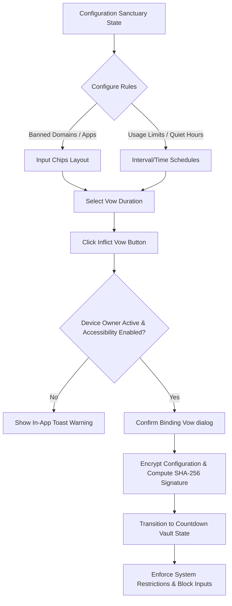
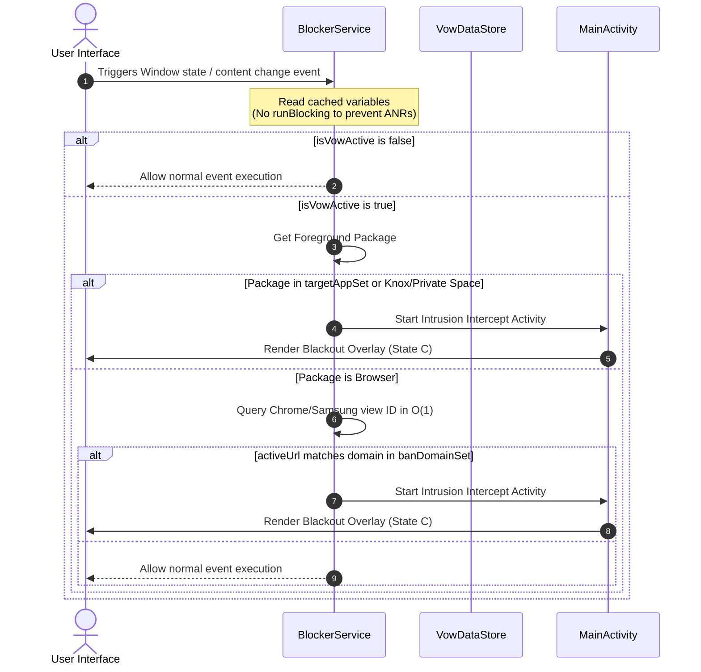
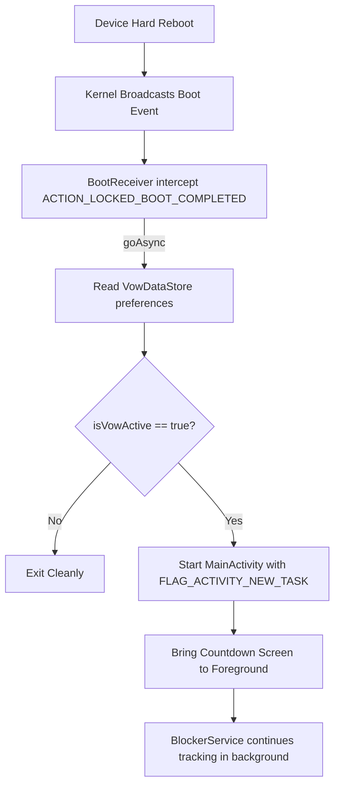

# aVow //📵 UNYIELDING DIGITAL BINDING VOW FOR ABSOLUTE FOCUS

`aVow` is an uncompromising, offline-first Android application designed for individuals who require ironclad, inescapable barriers against digital distractions. It turns your mobile device into a dedicated, single-purpose workspace by enforcing a mathematically final countdown lockout.

Unlike conventional blocking utilities that can be bypassed by clearing app data, turning off accessibility permissions, or uninstalling the blocker, `aVow` integrates directly with Android’s system security frameworks via **Enterprise Device Owner** privileges. There are no administrative loopholes, no emergency passwords, and no "quit" buttons. Once the Vow is struck, the hardware enforces it until the timer lapses.

---

## 🚀 Repository & Project Details

- **GitHub Repository:** [olusheki/avow](https://github.com/olusheki/avow)
- **Author/Concept:** Daniel Olusheki
- **Development Tooling:** Scaffolded and optimized using **Google Antigravity 2.0** in conjunction with Android Studio.

---

## 🛠️ System Architecture & Compatibility

| Specification | Value |
| :--- | :--- |
| **Minimum SDK** | API 34 (Android 14) |
| **Target SDK** | API 36 (Android 16) |
| **Compile SDK** | API 36 (Android 16.1) |
| **Aesthetic Theme** | Minimal Monospace "Lab-Stark" |
| **Internet Access** | None (Fully Local & Offline-First) |

---

## 💎 Core Features

### 1. Inescapable Countdown Lock (Binding Vow)
* **Monolithic Dashboard:** Upon activation, the entire user interface collapses into an opaque, light graphite-grey countdown screen showing a center-aligned SVG outline representation of the client's signature smiley logo.
* **Ticking Loop:** The countdown ticking loop runs continuously in the background, decoupled from UI transitions to prevent bypasses. To eliminate countdown drift when the screen is off or the CPU enters deep sleep, the loop utilizes a monotonic system uptime differential (`SystemClock.elapsedRealtime()`) to precisely measure elapsed intervals. This design makes the countdown immune to manual system date/time or timezone tampering.
* **Duration Limits:** Supports lock durations ranging from 1 hour up to 90 days. Users can add additional time to an active Vow, but cannot shorten it.

### 2. Enterprise Device Administration Policies
To prevent system-level bypasses, `aVow` requests Device Owner privileges to enforce:
* **Block Uninstallation:** Disables the ability to uninstall `aVow`.
* **Block Data Wipe:** Restricts factory resets and application data clearance.
* **Disable Safe Boot:** Blocks bypassing restrictions by rebooting into Android Safe Mode.
* **Block Google Play Store:** Suspends access to installing new distracting applications.
* **Deactivate USB Debugging:** Prevents using ADB commands to force-stop or disable the application.
* **Target Profile Suspension:** Actively suspends Knox Secure Folders and Android 15 Private Spaces when restrictions are triggered.

### 3. High-Performance Accessibility Blocker Service
* **Zero-Lag URL Extraction:** Directly queries view node IDs for Google Chrome and Samsung Internet to verify address navigation in $O(1)$ time, eliminating split-second leaks.
* **ANR Prevention:** Asynchronously collects DataStore settings within a background `CoroutineScope` in `onCreate()` to maintain an in-memory cache. The accessibility event loop executes checks instantly without blocking the main UI thread.
* **Active Intrusion Interception:** Instantly redirects the user to the countdown overlay if they attempt to open restricted apps or visit blacklisted domains.

### 4. Stark Monospace Chip Sets (Multi-Targeting)
* **Set-Based Preferences:** Configurations for blocked domains, usage limit targets, and Quiet Hours apps use `Set<String>` collections persistently stored via Jetpack DataStore.
* **Monospace Input Chips:** Renders configured items as stark monospace chips with custom outline shapes and circular `[x]` trailing buttons.
* **Append-Only Under Lock:** Users are permitted to type new domains or select additional apps to append to target sets while locked, but the chip deletion `[x]` button is strictly disabled/blocked until the countdown expires.
* **Tamper-Resistant Signatures:** Applies alphabetical sorting (`sorted().joinToString(",")`) to sets before computing SHA-256 state signatures to maintain deterministic verification hashes.

### 5. Hardware Reboot Interception (Tripwire)
* **Direct Boot Awareness:** Registers a receiver (`BootReceiver`) with `android:directBootAware="true"` listening to `ACTION_BOOT_COMPLETED` and `ACTION_LOCKED_BOOT_COMPLETED`.
* **Auto-Relaunch:** If a device is rebooted while a Vow is active, the receiver launches `MainActivity` immediately on bootup to bring the countdown screen to the foreground layer before the user can bypass the locks.

---

## 🎨 Design System & Visual Specification

The interface is built to feel clear, stark, and structured, resembling a technical laboratory runtime environment.

### Monotonal Color Tokens
* **The Backdrop Layer (`#6E6E6E`):** Light graphite gray extending across all backgrounds, primary windows, and active lockout screens.
* **The Structural Panels (`#7A7A7A`):** Low-contrast, sharp-cornered containers used for inputs and check matrices.
* **The Grid Dividers & Outlines (`#8A8A8A`):** Uniform thin lines separating UI blocks, check marks, and outline vectors.
* **The Typography Face (`#F5F5F5`):** Matte ice white for active text, headers, and digital clock metrics.
* **The Sub-Labels (`#B5B5B5`):** Carbon gray for system descriptions, labels, and inactive configurations.
* **The Accent Lock Red (`#FF5252`):** Alert red applied strictly to indicators showing locked states or block alerts.

### Typographic Grid Layout
All typography uses uppercase monospace fonts (IBM Plex Mono). Layout parameters are enclosed in stark brackets (e.g., `[ STATUS: ACTIVE ]`, `[ aVow // STATUS: OPEN ]`). Text headers rely on letter-spacing rather than font weights to construct layout contrast.

### Smiley Outline Vector Specifications
The logo is drawn using a constant-width `#8A8A8A` line vector on a `200x200` viewBox:
- **Outer boundary circle:** Radius `80` units, centered at `(100, 100)`.
- **Eyes:** Two circular elements with radius `10` units, centered at `(75, 82)` and `(125, 82)` respectively.
- **Smile:** A uniform cubic Bezier curve starting at `(60, 130)`, curving with control points through `(75, 150)`, `(100, 150)`, `(125, 150)`, and ending at `(140, 130)`.

---

## 📱 User Interface States

### State A: Configuration Sanctuary (Inactive Vow)
* **Status Header:** Displays `[ aVow // STATUS: OPEN ]` in ice-white text.
* **App Selection Checklist:** Scrollable list of launchable system applications with basic checkbox brackets `[ ]` showing their status.
* **Web Domain Selection (`BAN_DOMAIN_SET`):** A custom monospace text field labeled `BAN_DOMAIN_SET >` equipped with an active typing cursor. Typing a domain and clicking `{ ADD }` appends the domain as a chip below.
* **Scheduling and Threshold Limits:** Configure time window allowances (e.g., allowed usage limit in minutes or hours per interval hour/day).
* **The Inflict Action Button:** A full-width, sharp rectangular action container at the bottom displaying `[ INFLICT BINDING VOW ]` that initiates the activation confirmation dialog.

### State B: Countdown Vault (Active Lock)
* **Status Header:** Displays `[ aVow // STATUS: LOCKED ]` in alert red.
* **Aesthetic Overlay:** All config inputs, checklist menus, and action buttons disappear.
* **Central Logo:** Center-aligned minimal smiley face outline vector.
* **Digital Clock:** Large, high-contrast digital clock formatted as `DD:HH:MM:SS` ticking down to countdown expiration.

### State C: Intrusion Intercept Block (Alert)
* **Blackout Overlay:** Fullscreen graphite gray background completely clearing all headers, sub-menus, and layout boundaries.
* **Centered Intercept Mark:** The minimal smiley face outline is rendered dead-center. The screen offers zero touch targets, blocking access to restricted app frames.

---

## 🛠️ Codebase Class Index

The codebase utilizes clean architecture patterns. The core classes and their roles are listed below:

1. **[VowDataStore.kt](file:///Users/danielolusheki/AndroidStudioProjects/aVow/app/src/main/java/com/avow/app/data/VowDataStore.kt):** Coordinates system preference writes and flow loading using Jetpack DataStore. Handles configuration mapping, timer countdown saves, and state signature verification.
2. **[BlockerService.kt](file:///Users/danielolusheki/AndroidStudioProjects/aVow/app/src/main/java/com/avow/app/service/BlockerService.kt):** Extends `AccessibilityService`. Inspects active window states, checks active browser nodes for Chrome and Samsung Internet to extract URLs, and intercepts Restricted Apps (Samsung Knox/Private Space) by launching the intrusion overlay activity.
3. **[BootReceiver.kt](file:///Users/danielolusheki/AndroidStudioProjects/aVow/app/src/main/java/com/avow/app/receiver/BootReceiver.kt):** Extends `BroadcastReceiver`. Listens to `BOOT_COMPLETED` broadcasts to verify if a lock countdown is active, restarting target overlay activities on boot to prevent lockout bypasses.
4. **[DeviceAdmin.kt](file:///Users/danielolusheki/AndroidStudioProjects/aVow/app/src/main/java/com/avow/app/receiver/DeviceAdmin.kt):** Extends `DeviceAdminReceiver`. Leverages `DevicePolicyManager` profiles to restrict uninstallation, grey out app force-close settings, block safe mode launches, and disable factory resets.
5. **[MainActivity.kt](file:///Users/danielolusheki/AndroidStudioProjects/aVow/app/src/main/java/com/avow/app/MainActivity.kt):** Application entry point and router. Configured with a `singleTask` launch mode to receive intrusion intent signals.
6. **[MainScreen.kt](file:///Users/danielolusheki/AndroidStudioProjects/aVow/app/src/main/java/com/avow/app/ui/MainScreen.kt):** Primary Jetpack Compose screen rendering layout states, configuration panels, active countdown tickers, and popup dialog selectors.

---

## 📊 Technical Architecture & Lifecycle Flows

### Vow Setup and Locking Lifecycle


### Accessibility Event Interception Flow


### Direct Boot Recovery Sequence


---

## ⚙️ Initial Setup & Deployment

Because `aVow` leverages powerful enterprise device administration APIs, it must be granted Device Owner privileges manually via Android Debug Bridge (ADB).

### Step 1: Build the Debug APK
Clone the repository and build the APK using Gradle:
```bash
git clone https://github.com/olusheki/avow.git
cd avow
./gradlew assembleDebug
```

### Step 2: Install and Grant Device Owner Privileges
1. Connect your device with USB Debugging enabled.
2. Install the compiled APK:
   ```bash
   adb install app/build/outputs/apk/debug/app-debug.apk
   ```
3. Remove all accounts from the device (Settings > Accounts) to allow setting a Device Owner.
4. Set `aVow` as the device owner:
   ```bash
   adb shell dpm set-device-owner com.avow.app/com.avow.app.receiver.DeviceAdmin
   ```
5. Re-add your user accounts.

### Step 3: Enable Accessibility Services
Go to **Settings > Accessibility > Installed Apps** and turn on the **aVow Blocker Service** to enable foreground application tracking and URL blocking.

---

## 🧪 Running the Verification Suite

The repository contains a robust JUnit and Mockk test suite verifying lock-out math, reboot survival, crash prevention, and signature checks.

To compile and run the tests:
```bash
./gradlew test
```

---

## 🤝 How to Get Involved

If you want to contribute to the project:
1. Fork the repository at [github.com/olusheki/avow](https://github.com/olusheki/avow).
2. Create a feature branch: `git checkout -b feat/your-improvement`.
3. Keep layout elements aligned with the stark, monotonic monospace theme (refer to [aVow Aesthetics.md](file:///Users/danielolusheki/AndroidStudioProjects/aVow/aVow%20Aesthetics.md) for details).
4. Run the test suite before submitting a Pull Request.
